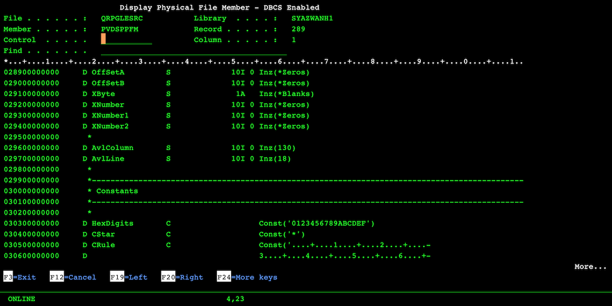

# AS400 Display Physical File Member DBCS Version
Similar to IBM DSPPFM command but you'd be able to see double-byte character set ('DBCS') values and translate ASCII to EBCDIC on display.

## Introduction
This tool was originally developed out of need to view DBCS in DSPPFM, but while RUNQRY can display DBCS the native AS/400 commmand is unable to do so. That's because RUNQRY knows how to process Shift-Out (X'0E') and Shift-In (X'0F') but DSPPFM only looks at each individual byte, as it should.

This program was designed to behave as close as possible to the original DSPPFM. Which means it will support:
1. Default record display
2. Top-down hex values after pressing F10
3. Side-by-side hex values after pressing F11

## How to Compile
First, upload the source to your AS/400 using FTP or other similar means, then set the correct source type for each member:
1. PVDSPPFM RPGLE
2. PVDSPPFMU C
3. PVDSPPFMD DSPF

Compile the DSPF first using option 14. Then the RPGLE and C using option 15. Finally, issue CRTPGM PGM(PVDSPPFM) MODULE(PVDSPPFM PVDSPPFMU). If you run into any difficulties with the source code, please verify that:
1. The source physical file ('PF') is at least 112 in length, for example, CRTSRCPF FILE(QRPGLESRC) RCDLEN(112).
2. The code page of the PF and your job is 37, for example, CHGJOB CCSID(37).
3. The FTP mode of transfer was set to ASCII during upload.

## Running the Program
The parameter list of the program is:
1. PF name
2. LIB name
3. MBR name

For example, CALL PVDSPPFM PARM('MYFILE' 'MYLIB' 'MBR').

If your LIB/FILE,MBR path is valid, the screen will load and the navigation keys are displayed at the bottom of the display.

Additionally, if you want to translate ASCII on the fly, use F23. Here's how:
1. Assume you're going to convert a square section of the screen.
2. Choose your top left corner on the records display and hit F23.
3. Then choose your bottom right corner on the records display and hit F23.

The ASCII data in that square section will then be converted to EBCDIC and you should be able to read it on disply.

## Additional Notes
This program was originally written to run on V5R2 using 5250 display in code page 037 and code page 1388. You will require ILE C compiler in addition to RPG and DDS. In order to display DBCS your terminal needs be configured to run in code page 935 (simplified Chinese). This should also work for Japanese code page but I've never personally tried.
